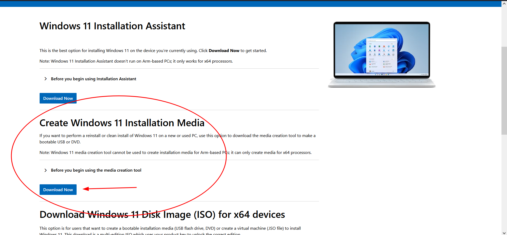

# Windows 11 Installation Guide

This guide walks you through the process of (re)installing Windows 11 on your computer. Follow the steps below for a clean installation.

### For this guide, you will need

- A USB flash drive with at least **8 GB** of storage (this will be used to create the Windows installation media).  
- A working Windows computer to download Windows 11 and create the installation USB. This can be the one you will be reinstalling windows on, or another if an OS hasn't been installed on that one yet or is not working correctly.  
- An internet connection (for downloading Windows and drivers).  
- Your PC where you want to install Windows 11.  

---

## Table of Contents

1. [Step 1: Download and Create a Windows Installation USB Drive](#step-1-download-and-create-a-windows-installation-usb-drive)
2. [Step 2: Boot from the USB Drive](#step-2-boot-from-the-usb-drive)
3. [Step 3: Install Windows 11](#step-3-install-windows-11)
4. [Optional: SSD Not Showing Up?](#optional-ssd-not-showing-up)
5. [Step 4: Out-Of-Box Experience (OOBE) Setup](#step-4-out-of-box-experience-oobe-setup)
6. [Step 5: Finalizing Setup](#step-5-finalizing-setup)
7. [Extra: No WIFI?](#extra-no-wifi)

---

## Step 1: Download and Create a Windows Installation USB Drive

1. **Download Windows 11**  
   Download the Media Creation Tool from Microsoft.

<table>
<tr>
<td>

Go to the official  
<a href="https://www.microsoft.com/en-gb/software-download/windows11/" target="_blank">
Microsoft Download Page for Windows 11
</a>.  
Click <strong>Download Now</strong> under "Create Windows 11 Installation Media."

</td>
<td>

</td>
</tr>
</table>


2. **Prepare a USB Drive**  
   Insert a USB drive (minimum 8GB in size) into your computer. Make sure the USB drive has no important data, as it will be wiped during this process.

3. **Run the Media Creation Tool**  
   Once the tool is downloaded, run it. Accept the terms and conditions, and choose the option to create installation media for another PC.

4. **Select Language, Edition, and Architecture**  
   Choose your preferred language, Windows edition, and architecture (64-bit is the most common). If you're unsure, leave the default settings selected.

5. **Select USB Flash Drive**  
   Choose "USB flash drive" when prompted. The tool will automatically detect available USB drives. Select your USB drive and click **Next**.

6. **Wait for the Creation Process to Finish**  
   The Media Creation Tool will download Windows 11 and create a bootable USB drive. This may take some time, depending on your internet speed.

   > 💡 **Hint:** While you're waiting for the Media Creatioon Tool to finish, it's a good idea to also copy your PC's network drivers onto the same drive. This can reduce hassle if your wifi doesn't work after installation. For more info, see [here](#extra-no-wifi).

---

## Step 2: Boot from the USB Drive

1. **Plug the USB into Your Computer**  
   Insert the USB drive with the Windows 11 installer into the target computer.

2. **Start the Computer**  
   Power on or restart the computer.

3. **Access the Boot Menu**  
   If the computer doesn't automatically boot from the USB, you'll need to access the boot menu. This is usually done by pressing a key such as **F2**, **F12**, **ESC**, or **DEL** immediately after turning on the computer. The exact key may vary, so refer to your computer’s manual or look for a prompt on the screen during boot.

4. **Select USB Device**  
   From the boot menu, select your USB drive as the boot device and press **Enter**.

---

## Step 3: Install Windows 11

1. **Start the Installation**  
   The Windows 11 installation process should begin. The first screen will ask you to select your region and language. Choose your preferences and click **Next**.

2. **Install Windows**  
   Click **Install Now**. If prompted for a product key, either enter it if you have one or choose the **I don’t have a product key** option to skip this step.

3. **Accept the License Agreement**  
   Read the terms and conditions, then click **Accept** to continue.

4. **Select Installation Type**  
   Choose **Custom: Install Windows only (advanced)** for a fresh installation.

5. **Partition Your Drive**  
   The installer will show a list of available disks, labeled as **Disk 0**, **Disk 1**, etc. To ensure you're selecting the correct disk:
   
   - Look at the **Total Size** of each disk to identify the main storage drive (it will usually be the largest disk).
   - Be cautious not to select any smaller drives or external drives (if applicable).
   - If you're installing on a new system or reformatting, you’ll need to delete any existing partitions on the selected disk. You can do this by selecting the partition, clicking **Delete**, and confirming the deletion.
   - Once the drive shows as **Unallocated Space**, select it and click **Next** to proceed with the installation.

   > **Note:** Deleting partitions will erase all data on that drive, so double-check before proceeding.

---

## [Optional] SSD Not Showing Up?

> ⚠️ **Important Alert:**  
> If, **immediately** after booting the Windows 11 installer for version 24H2, your SSD or storage drives do **not** show up, this is a known Microsoft error specific to 24H2.  
>  
> This alert only applies if the lack of detected drives happens right away when the installer starts. If the drives fail to show up later in the process (for example, after clicking "Next" a few times), this is likely a different issue.  
>  
> To fix this, you will need to download and use the older Windows 11 23H2 installation media, which does not have this problem and should detect your drives correctly. (It might be possible to get around this by placing the 24H2 install.wim into the 23H2 installer, this hasn't been fully tested though, so be warned!)


1. **Install Chipset Drivers**  
   If your SSDs do not show up during the installation, it's likely due to missing chipset or storage controller drivers for your motherboard. To resolve this, you’ll need to load the drivers from your motherboard's manufacturer.

2. **Download Chipset / Storage Controller Drivers**  
   Go to the manufacturer’s website (e.g., ASUS, MSI, Gigabyte, etc.) search up your specific model, and download the latest controller drivers. Transfer these drivers to the USB drive with Windows (just make sure you know where you put them).

3. **Load the Drivers During Installation**  
   While on the disk selection screen, click **Load Driver**. Insert the USB drive containing the chipset/storage drivers and browse to the location of the drivers. Select them and continue.

4. **Continue Installation**  
   Once the drivers are loaded, your SSD should now appear as a selectable drive. Select it and click **Next** to proceed with the installation.

---

## Step 4: Out-Of-Box Experience (OOBE) Setup

1. **Complete OOBE**  
   Once the installation is complete, the computer will reboot and enter the **Out-of-Box Experience (OOBE)**. This is the process where you’ll set up your account, preferences, and other settings.

2. **Skip Microsoft Account (Optional)**  
   By default, Windows 11 prompts you to sign in with a Microsoft account. If you'd prefer to set up a local account instead, you can bypass this screen:
   
   - When you reach the Microsoft account sign-in screen, press **Shift + F10** to open a Command Prompt window.
   - In the command prompt, type the following command and press **Enter**:
     ```bash
     start ms-cxh:localonly
     ```
     This will take you to the option to create a local account.

3. **Create a Local Account**  
   Follow the on-screen instructions to create a local user account instead of a Microsoft account. You will still have access to all features, and this method helps to avoid unnecessary Microsoft account integration.

---

## Step 5: Finalizing Setup

1. **Customization**  
   Once you’ve set up your account (local or Microsoft), follow the prompts to complete the setup. You’ll be asked to choose privacy settings, connect to Wi-Fi, and configure Cortana (if applicable).

2. **Install Windows Updates**  
   Once the setup is complete, go to **Settings** > **Update & Security** > **Windows Update** and check for any available updates. It’s important to install these updates for optimal performance and security.

3. **Install Device Drivers**  
   After Windows is fully set up, it’s a good idea to install any missing drivers (especially graphics, sound, and network drivers). You can download these from the manufacturer's website or use Windows Update to automatically detect and install drivers.

4. **Restore Your Files**  
   If you backed up your files, now is the time to restore them to your new Windows installation.

5. **[Optional] Check out some programs!**
   Looking for programs to install on your fresh copy of Windows. Check out my favourite programs [here](https://randomtester0.github.io/testing-website/software-list.html)
---

By following these steps, you should have a clean installation of Windows 11 on your computer. If you run into any issues, feel free to ask for further assistance!

---

### Extra: No WIFI?

If you don’t see any Wi-Fi networks during or after setup, it usually means the Wi-Fi driver is missing. Here’s how to install it using another computer and a USB drive:

1. **Find Your Motherboard or Laptop Model**  
   Locate your motherboard or laptop model number. You can usually find this on a label on your device or in the documentation.

2. **Download Drivers on Another Computer**  
   Using a working computer with internet access, visit the motherboard or laptop manufacturer’s official support website.

3. **Search for Network/Wi-Fi Drivers**  
   Enter your device model, then navigate to the **Drivers** or **Downloads** section. Look for the **Network** or **Wireless** driver compatible with your Windows version (e.g., Windows 11, 64-bit).

4. **Download the Driver File**  
   Download the Wi-Fi driver installer file (usually `.exe` or `.zip`).

5. **Copy Drivers to a USB Drive**  
   Transfer the downloaded driver file to a USB flash drive.

6. **Install Drivers on Your New PC**  
   Plug the USB drive into your new PC. Open **File Explorer**, find the driver file, and run the installer. Follow the on-screen instructions to complete installation.

7. **Restart and Connect to Wi-Fi**  
   Restart your PC if prompted. After reboot, click the Wi-Fi icon in the taskbar, select your network, and connect.

---

If you still don’t see Wi-Fi networks after this, try using a wired Ethernet connection temporarily and run Windows Update to see if the issue is fixed.

---

**That should be it! Please suggest any improvements to this guide so we can help more people easily install Windows.** 
